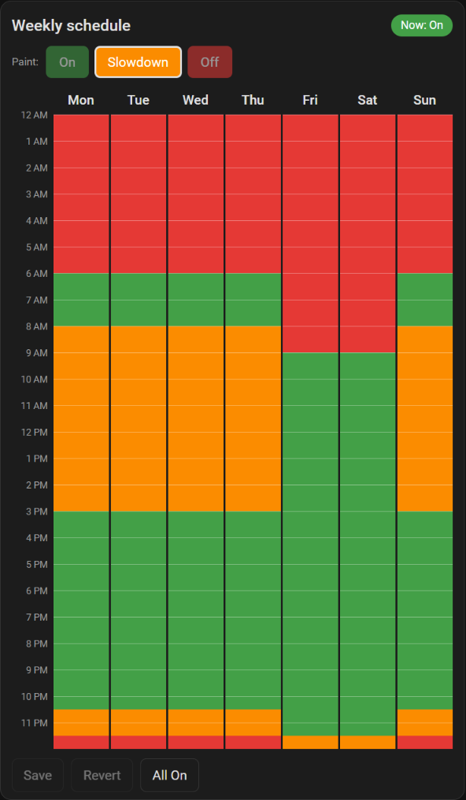

# State Schedule Card

A Home Assistant dashboard card for painting a **weekly schedule of states** on a Mon–Sun grid.

Pick a state (for example *On*, *Slowdown*, *Off*), drag across the week, press **Save**. Every cell of the week always holds a state, so there is no "unscheduled" gap — time you don't paint is simply the default state.

It works with any `input_select` or `select` entity, and uses the
[Scheduler integration](https://github.com/nielsfaber/scheduler-component) as its engine: saving converts the grid into Scheduler entries that call `input_select.select_option` (or `select.select_option`) at the start of each block.

<p align="center"></p>

## Why

The built-in `schedule` helper is on/off only, and the Scheduler card edits one set of days at a time. This card gives you one picture of the whole week, with as many states as your entity has options.

## Requirements

- Home Assistant
- [Scheduler](https://github.com/nielsfaber/scheduler-component) integration (install via HACS, then add the *Scheduler* integration)
- An `input_select` / `select` entity whose options are the states you want to schedule

## Install (HACS custom repository)

1. HACS → ⋮ → **Custom repositories**
2. Repository: `https://github.com/nickmayer/state-schedule-card`, Type: **Dashboard**
3. Install **State Schedule Card**, then hard-refresh the browser.

## Use

```yaml
type: custom:state-schedule-card
entity: input_select.internet_cole
title: Cole – weekly internet schedule
```

| Option | Default | Description |
| --- | --- | --- |
| `entity` | *required* | `input_select.*` or `select.*` entity to schedule |
| `title` | entity name | Card title |
| `step` | `30` | Grid resolution in minutes: `10`, `15`, `20`, `30`, `60` |
| `default_state` | `On` if present, else first option | State used for time you don't paint, and for **All …** |
| `states` | – | Per-option `label` and `color`, e.g. `Off: {label: Blocked, color: "#b71c1c"}` |
| `name` | entity name | Base name for the Scheduler entries the card creates |
| `apply_now` | `true` | After saving, immediately set the entity to what the grid says for the current time |
| `row_height` | `14` | Pixel height of a grid row |
| `collapsed` | `true` | Start collapsed to a single line (title + current state). Click the header to expand |
| `current` | `entity` | Entity shown in the "Now:" chip — the state actually in effect (see *Override*) |
| `override` | – | Enables the override controls, see below |

Click a **day name** to fill that whole day with the selected state.

## Override

Temporarily replace the schedule without editing it. Add three helpers and the bundled automation blueprint:

| Helper | Role |
| --- | --- |
| `input_select.x_schedule` | What the **schedule** writes to — the card's `entity` |
| `input_select.x_override` | Options: a "follow the schedule" option (`Schedule`), then each state |
| `input_boolean.x_override_sticky` | The "keep until cleared" checkbox |
| `input_select.x_now` | The state **in effect** — use this one in the rest of your setup |

```yaml
type: custom:state-schedule-card
entity: input_select.x_schedule
current: input_select.x_now
override:
  entity: input_select.x_override
  sticky: input_boolean.x_override_sticky   # optional
  none_option: Schedule                      # optional, default: first option
```

Then create an automation from the blueprint
[`blueprints/automation/state_schedule_override.yaml`](blueprints/automation/state_schedule_override.yaml)
([import](https://my.home-assistant.io/redirect/blueprint_import/?blueprint_url=https%3A%2F%2Fgithub.com%2Fnickmayer%2Fstate-schedule-card%2Fblob%2Fmain%2Fblueprints%2Fautomation%2Fstate_schedule_override.yaml))
and point its inputs at the helpers above. It copies *scheduled → now*, unless an override is active.

In the card, pick **On / Slowdown / Off** to override, or **Follow schedule** to clear it. The checkbox decides how long it lasts:

- **Unchecked** — the override ends the next time the *scheduled* state changes (a block boundary where the state stays the same does not count).
- **Checked** — the override stays until you switch back to **Follow schedule**.

## How it behaves

- **The card owns the schedules for its entity.** On save it creates new Scheduler entries from the grid and removes every existing Scheduler entry that targets the same entity — including ones made by hand or by the Scheduler card. Existing schedules are read into the grid when the card loads, so nothing is lost the first time you open it.
- Identical days are grouped into one Scheduler entry, so a typical week is 1–3 entries.
- Scheduler only acts at the **start** of each block. A manual change to the entity holds until the next block starts.
- Schedules that use conditions, several actions per slot, or start/end dates can't be represented on the grid; they are ignored when loading and replaced on save.

## Development

```bash
npm test      # unit tests for the grid <-> Scheduler conversion
```

The card is a single dependency-free ES module in `dist/state-schedule-card.js`.

## License

MIT
